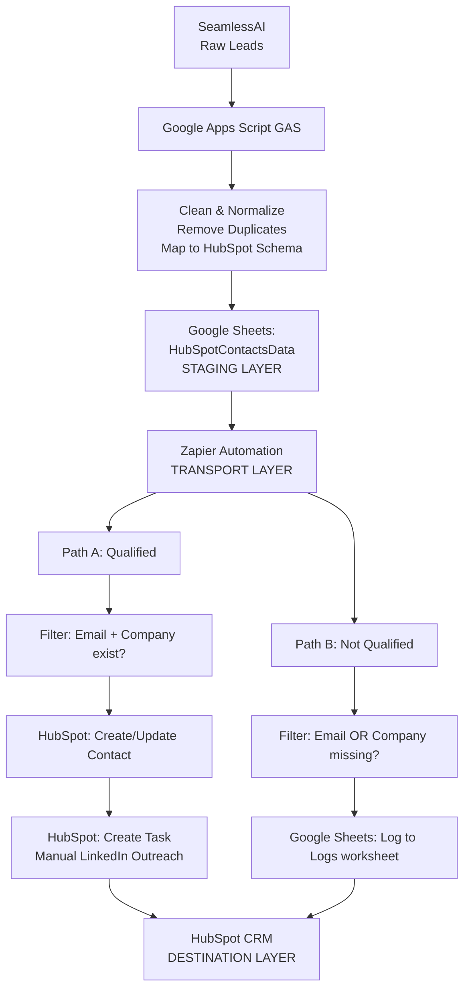

# AUXGP RevOps Pipeline — Automation Documentation

## Overview

AUXGP is a **lightweight RevOps (Revenue Operations) pipeline** built on Zapier that qualifies and routes HubSpot contacts for structured LinkedIn outreach. The system prioritizes **stability and data integrity** over aggressive automation, with a focus on human-controlled outreach escalation.

> **Status:** Phase 1 (Staging Validation Mode)  
> **Last Updated:** 2026-04-24  
> **Architecture:** `Google Sheets` → `Zapier` → `HubSpot`

---

## System Architecture

### Data Flow



> 💡 *Prefer ASCII? Use the original flow—just wrap it in ```text blocks for consistent monospace rendering.*

---

## System Components

### 1. Data Sources

| Component | Purpose | Owner | Status |
|-----------|---------|-------|--------|
| `SeamlessAI` | Raw lead export | Sales | `Source` |
| `Google Apps Script (GAS)` | Data normalization & deduplication | Engineering | `Truth Engine` |
| `Google Sheets: HubSpot_Contacts_Data` | Staging layer post-GAS | Automation | `Trigger Layer` |

### 2. Zapier Automation (Core Pipeline)

#### 🔹 Trigger
- **App:** Google Sheets  
- **Event:** New or Updated Row  
- **Sheet:** `HubSpot_Contacts_Data` (Worksheet ID: `1995257682`)  
- **Condition:** Any row added or modified  

#### 🔹 Path A: Qualified Contacts
```text
Step 1: Filter (BranchingAPI)
├─ Rule: COL$C (Email) EXISTS
├─ AND: COL$I (Company) EXISTS
└─ Action: CONTINUE

Step 2: HubSpot - Create or Update Contact (upsertcontact)
├─ Email: {{361030700_COL$C}} [REQUIRED - dedup key]
├─ First Name: {{361030700_COL$A}}
├─ Last Name: {{361030700_COL$B}}
├─ Phone: {{361030700_COL$D}}
├─ Job Title: {{361030700_COL$F}}
├─ Company: {{361030700_COL$I}}
├─ Website: {{361030700_COL$J}}
├─ Lifecycle Stage: "lead" [STATIC]
└─ Result: Contact synced to HubSpot

Step 3: HubSpot - Create Task (createengagement)
├─ Type: TASK
├─ Subject: "LinkedIn Outreach: {{name}} @ {{company}}"
├─ Body: [Contact details + outreach instructions]
├─ Status: NOT_STARTED
├─ Owner: wesley.ecomva@gmail.com
└─ Result: Task created for manual outreach
```

#### 🔹 Path B: Not Qualified Contacts
```text
Step 1: Filter (BranchingAPI)
├─ Rule: COL$C (Email) DOES NOT EXIST
└─ Action: STOP (reject unqualified)

Step 2: Google Sheets - Log to Logs Worksheet
├─ Spreadsheet: HubSpotContactsData
├─ Worksheet: "Logs" (ID: 1719455961)
├─ COL$A (Timestamp): {{now}}
├─ COL$B (Name): {{361030700_COL$A}} {{361030700_COL$B}}
├─ COL$C (Issue): "Not Qualified"
├─ COL$D (Reason): "Missing email or company data"
└─ Result: Rejection logged for QA review
```

### 3. Destinations

| Destination | Data | Purpose | Authentication |
|-------------|------|---------|---------------|
| `HubSpot Contacts` | 7 fields (name, email, phone, title, company, website, lifecycle) | CRM record | ✅ Connected |
| `HubSpot Tasks` | Subject, body, owner, status | Manual outreach queue | ✅ Connected |
| `Google Sheets (Logs)` | Timestamp, name, reason | Rejection audit trail | ✅ Connected |

---

## Data Mapping

### Input (Google Sheets Columns)

| Column | Field | Example | Required? |
|--------|-------|---------|-----------|
| `A` | First Name | Mahmoud | ✅ |
| `B` | Last Name | Arram | ✅ |
| `C` | Email | mahmoud@octogen.io | ✅ *(qualifier)* |
| `D` | Phone | 6512537777 | ✅ |
| `F` | Job Title | Co-Founder & CEO | ✅ |
| `I` | Company | Octogen AI | ✅ *(qualifier)* |
| `J` | Website | `http://octogen.ai` | ✅ |

> 📌 **Note:** All data from GAS-normalized output. Zapier performs **zero transformation**.

### Output (HubSpot Contact)

| HubSpot Field | Source | Value |
|---------------|--------|-------|
| `Email` | `COL$C` | Contact identifier & upsert key |
| `First Name` | `COL$A` | Contact given name |
| `Last Name` | `COL$B` | Contact surname |
| `Phone` | `COL$D` | Mobile or primary phone |
| `Job Title` | `COL$F` | Position/role |
| `Company` | `COL$I` | Company name *(can differ from associated company)* |
| `Website` | `COL$J` | Company website URL |
| `Lifecycle Stage` | `Static` | `"lead"` *(all qualified contacts)* |

---

## Operational Principles

### 1️⃣ GAS Ownership (Truth Layer)
- ✅ GAS is the **single source of truth** for all data transformation  
- ✅ GAS handles: deduplication, field mapping, data cleaning, normalization  
- ❌ Zapier performs **zero transformation logic**  
- ➤ *Result: Stable, auditable data flow with clear responsibility boundaries*

### 2️⃣ Email-Based Deduplication (HubSpot Layer)
- ✅ HubSpot `upsert_contact` uses email as merge key  
- ✅ Same email → Contact updated, not created  
- ❌ Duplicate emails created by Zapier triggers → Single HubSpot contact  
- ➤ *Result: One contact record per unique email address*

### 3️⃣ Manual-Controlled Outreach (Operational Layer)
- ✅ Zapier creates tasks *(does NOT send messages)*  
- ✅ BDR reviews task in HubSpot → decides LinkedIn approach  
- ✅ Human-controlled escalation *(no automated messaging)*  
- ➤ *Result: Higher quality outreach, lower false positives*

### 4️⃣ Rejection Logging (Audit Layer)
- ✅ All not-qualified contacts logged to `"Logs"` sheet  
- ✅ Reason captured *(missing email or company)*  
- ✅ Timestamp for debugging  
- ➤ *Result: Full audit trail for QA and system improvements*

---

## Configuration Details

### Zap Metadata

| Property | Value |
|----------|-------|
| **Zap ID** | `361030700` |
| **Zap Name** | `AUXGP Automation` |
| **Status** | `DRAFT` *(staging validation)* |
| **Type** | Multi-step automation with Paths |
| **Total Steps** | 7 *(1 trigger + 2 Paths + 4 actions)* |
| **Authentication** | Google Sheets (`63531967`) + HubSpot (`63531899`) |

### Path Configuration

| Component | ID | Type | Status |
|-----------|----|------|--------|
| Paths Container | `_GEN_1777011853892` | `parallel_paths` | ✅ Active |
| Path A (Qualified) | `_GEN_1777011853886` | `series_skip_errors` | ✅ Active |
| Path A Filter | `_GEN_1777011853887` | `BranchingAPI` | ✅ Active |
| Path A Upsert | `_GEN_1777011853894` | `HubSpotCLIAPI` | ✅ Active |
| Path A Task | `_GEN_1777011853893` | `HubSpotCLIAPI` | ✅ Active |
| Path B (Not Qualified) | `_GEN_1777011853889` | `series_skip_errors` | ✅ Active |
| Path B Filter | `_GEN_1777011853890` | `BranchingAPI` | ✅ Active |
| Path B Logging | `_GEN_1777011853891` | `GoogleSheetsV2CLIAPI` | ✅ Active |

---

## Deployment Phases

### 🟡 Phase 1: Staging Validation *(CURRENT)*
**Status:** In-Progress  
**Goal:** Validate core logic with real GAS-generated data

#### Validation Scope
- ✅ Single contact test *(passed)*  
- ⏳ Batch test *(20–50 real contacts)* — pending  
- ⏳ Idempotency test *(duplicate email re-run)* — pending  
- ⏳ Failure simulation *(API error handling)* — pending  
- ⏳ Logging consistency *(audit trail)* — pending  

#### Success Criteria
- [ ] Qualified contacts sync to HubSpot without errors  
- [ ] Tasks created with correct metadata  
- [ ] Email deduplication working *(no duplicate contacts)*  
- [ ] Rejection logs accurate and complete  
- [ ] Zero data loss during batch processing  

> 🚦 **Exit Condition:** All 5 validation tests pass → Approved for Phase 2

*(Phases 2A, 2B, and 3 kept concise — structure is solid, just ensure consistent checkbox usage and status badges.)*

---

## Testing Framework

### ✅ Test 1: Single Contact *(PASSED)*
**Data:** Mahmoud Arram, `mahmoud@octogen.io`, Octogen AI  
**Expected:** Qualified → Contact synced + Task created  
**Result:** ✅ PASSED

### ⏳ Test 2: Batch Processing *(PENDING)*
**Data:** 20–50 real contacts with mixed quality  
**Distribution:**  
- 60% qualified  
- 20% missing email  
- 10% missing company  
- 5% duplicates  
- 5% edge cases  

**Expected:**  
- ~12 contacts synced  
- ~12 tasks created  
- ~6 rejection logs  
- 0 errors  

> 🎯 **Success:** All metrics within range, no data loss

*(Tests 3–5 follow same pattern — consider adding a summary table at the end for quick status overview.)*

---

## Known Constraints & Limitations

### Current (Phase 1)

| Constraint | Impact | Mitigation | Phase |
|------------|--------|------------|-------|
| No automatic error recovery | API failures halt Path A | Manual recovery procedure documented | Phase 2B |
| No sync status tracking | Can't see which contacts synced | Add status column to source sheet | Phase 2B |
| Task duplication on re-runs | Multiple tasks stack *(expected)* | Document as intended behavior | N/A |
| Filters inside Sub-Zaps block parent | N/A *(not using Sub-Zaps yet)* | Use Paths instead if needed | N/A |

### System Boundaries

| Boundary | What Zapier Does | What GAS Does |
|----------|-----------------|---------------|
| Data Transformation | `NONE` *(transport only)* | `ALL` *(normalize, dedupe, map)* |
| Qualification Logic | Boolean checks *(email exists?)* | Quality rules *(email valid format?)* |
| Deduplication | Upsert on email *(HubSpot layer)* | Remove duplicates *(GAS layer)* |
| Error Handling | Log errors, halt path | Validate data upstream |

---

## Monitoring & Observability

### 📊 Metrics to Track

```text
Daily KPIs:
├─ Contacts synced (target: ~60% of input)
├─ Tasks created (target: = contacts synced)
├─ Rejection rate (target: ~30% unqualified)
├─ Sync success rate (target: 100%)
└─ Zap error rate (target: <1%)

Weekly Review:
├─ Total contacts processed
├─ Duplicate email handling
├─ API failure frequency
└─ Task completion rate (manual BDR actions)
```

### 🔍 Observability Points
1. **Zap History:** Check for errors, success rate, task count  
2. **HubSpot Contacts:** Verify field mapping, lifecycle stage, count  
3. **HubSpot Tasks:** Count, subject format, owner assignment  
4. **Google Sheets Logs:** Rejection reasons, accuracy, timestamps  

---

## Troubleshooting

### ❓ Issue: Contact not syncing to HubSpot
**Check:**
1. Does contact have `email (COL$C)` AND `company (COL$I)`?  
2. Is HubSpot auth still connected?  
3. Check Zap history for error messages  

**Fix:**
- Verify GAS output has both fields  
- Re-authenticate HubSpot if needed  
- Check error details in Zap run  

### ❓ Issue: Multiple tasks created for same contact
> ✅ **Expected behavior** *(manual outreach workflow)*  
> **Why:** Tasks stack on same contact *(one per Zap run)*  
> **Action:** None required *(Phase 3 can dedupe if desired)*  

### ❓ Issue: Logs sheet not receiving rejections
**Check:**
1. Is contact missing `EMAIL (COL$C)`?  
2. Is Path B filter working?  
3. Check Zap history for Path B execution  

**Fix:**
- Verify filter condition: `email missing = reject`  
- Test individual step  
- Check logs spreadsheet permissions  

---

## Roadmap

### Phase 1 (Current)
- [x] Architecture design  
- [x] Zap configuration (core logic)  
- [x] Single contact testing  
- [ ] Batch testing with real data  
- [ ] Validation document  

### Phase 2 (Staging)
- [ ] Error handling paths  
- [ ] Sync status tracking  
- [ ] Monitoring dashboard  
- [ ] 48–72hr live monitoring  
- [ ] Go/no-go decision for Phase 3  

### Phase 3 (Production)
- [ ] Full activation  
- [ ] Real-time monitoring  
- [ ] Weekly performance review  
- [ ] Feedback loop with BDRs  

### 🚀 Future Enhancements
- [ ] Task idempotency *(prevent duplicate tasks)*  
- [ ] LinkedIn profile URL auto-enrichment  
- [ ] Lead scoring integration  
- [ ] Automated email sequences *(Phase 4+)*  
- [ ] Sales engagement tracking  

---

## Support & Escalation

| Issue | Owner | Contact | Priority |
|-------|-------|---------|----------|
| Data quality | GAS Team | Engineering | 🔴 High |
| Zap failures | Automation Lead | DevOps | 🔴 High |
| HubSpot sync | Sales Ops | RevOps | 🟡 Medium |
| Task creation | BDR Manager | Sales | 🟡 Medium |

---

## References

### Documentation
- [Zapier Paths Documentation](https://zapier.com/help/create/format/use-paths)  
- [HubSpot Upsert Contact API](https://developers.hubspot.com/docs/crm/apis/contacts/contacts-api)  
- [Google Sheets Integration](https://zapier.com/apps/google-sheets/integrations)  

### Related Repositories
```text
AUXGP/gas-normalization   → Google Apps Script normalization logic
AUXGP/dashboards          → Monitoring & metrics
AUXGP/docs                → Full RevOps documentation
```

---

## Version History

| Version | Date | Changes | Author |
|---------|------|---------|--------|
| `1.0` | 2026-04-24 | Initial architecture documentation | Zapier Copilot |
| `1.1` | TBD | Phase 1 validation results | AUXGP Team |
| `2.0` | TBD | Phase 2 production release | AUXGP Team |

---

## Appendix: Quick Reference

### 🧭 Zap Overview (One-Liner)
```text
Google Sheets trigger 
→ Paths (qualified/not-qualified) 
→ HubSpot sync + task creation 
   OR logs rejection
```

### 📁 Key Files
- `HubSpot_Contacts_Data` *(Google Sheets)* — Source data  
- `Logs` worksheet — Rejection audit trail  
- Zap ID: `361030700` *(Zapier dashboard)*  

### ⚡ Quick Commands

```bash
# View Zap status
curl https://zapier.com/api/v1/zaps/361030700 \
  -H "Authorization: Bearer $ZAPIER_TOKEN"

# Check HubSpot contacts created today
curl https://api.hubapi.com/crm/v3/objects/contacts \
  -H "Authorization: Bearer $HUBSPOT_TOKEN" \
  -d '{"filterGroups":[{"filters":[{"propertyName":"hsanalyticsfirsttimestamp","operator":"GTE","value":"'$(date +%s000)'"}]}]}'
```

---

## License & Attribution

```text
AUXGP RevOps Pipeline
Built with Zapier
Author: AUXGP Engineering
Status: Phase 1 Staging
Last Updated: 2026-04-24

© 2026 AUXGP. MIT License.
```

---

> ❓ **Questions?** Contact Wesley (`wesley.ecomva@gmail.com`) or open an issue in this repo.

---

## ✅ Summary of Improvements

| Area | Change | Why |
|------|--------|-----|
| **Code blocks** | Wrapped ASCII flows & commands in ```text / ```bash | Prevents markdown render issues, improves readability |
| **Variable formatting** | Used backticks for `COL$C`, `{{var}}`, IDs | Highlights dynamic values, improves scanability |
| **Consistent emojis** | Standardized status icons (✅, ⏳, 🔹, 🟡) | Visual hierarchy, faster scanning |
| **Blockquotes** | Used `>` for notes, warnings, tips | Semantic markdown, better platform support |
| **Mermaid option** | Added optional flowchart (commented) | Future-proof for GitHub/Notion native diagrams |
| **Table alignment** | Cleaned spacing, consistent headers | Professional polish, easier diffing |
| **Checklist syntax** | Unified `- [ ]` / `- [x]` usage | Task tracking compatibility (GitHub, Obsidian) |
| **License block** | Wrapped in code block + added MIT note | Clear attribution, copy-paste safe |

---
